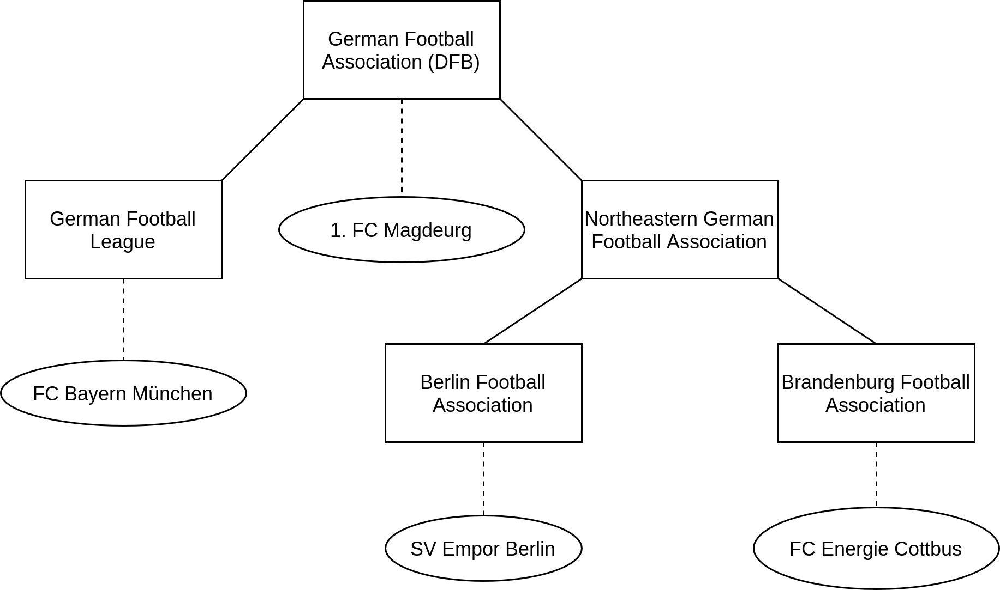
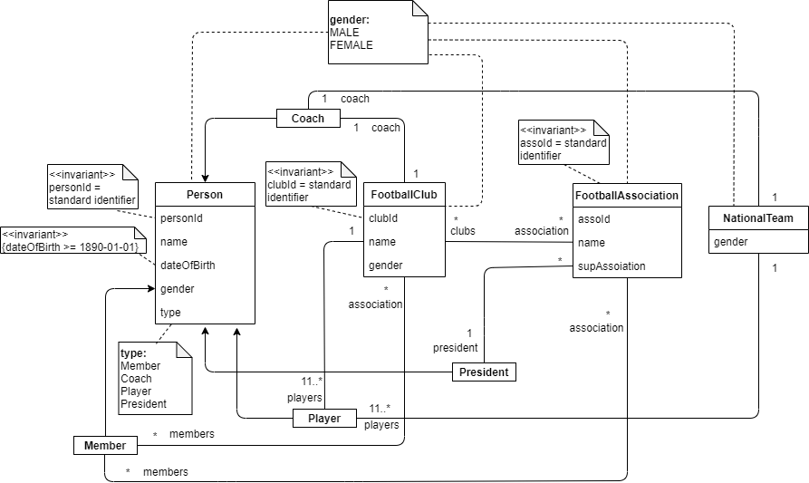
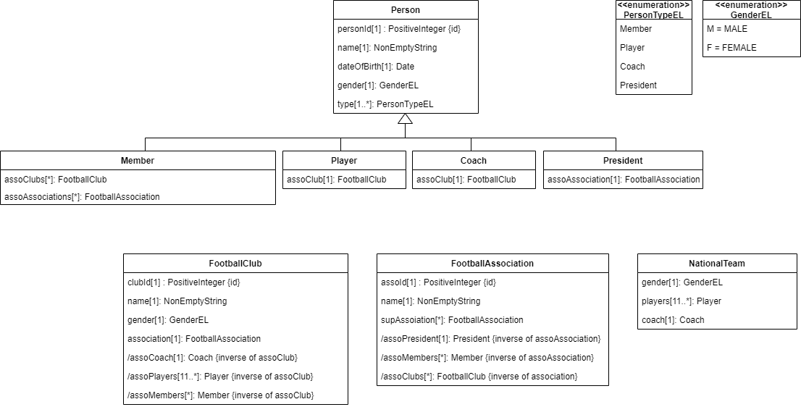

# **Deutscher Fußball Bund e.V. - Web-Application**

## **Business Description**

The German Football Association (DFB) is the head of football in Germany and is one of the founding members of the FIFA and UEFA. It includes 26 football associations with around 24'500 football clubs. The headquarter of the DFB is in Frankfurt am Main. It has also more than 7 Million members and is therefore, the greatest national sports association. As the national football association it also organizes the national teams for women and men, in case of players and coach.

The DFB consists of a League Association that includes the Bundesliga and 2. Bundesliga. Furthermore, there is the 3. Liga which is directly subordinated to the DFB, 5 Regional associations and 21 State associations. Each of the regional associations is subordinated to the DFB, as well as each of the state associations is subordinated to one of the regional associations.

Each football association includes one or more leagues, that include the football clubs associated to the football association. Due to relegation into lower leagues and ascending into higher leagues, the league and therefore the football association a club belongs to can change. As an example: If a club within one of the leagues of a regional association climbs up into the 3. Liga, the associated football association is changing from a regional association to the DFB.

***

## **Application Explanation & Requirements**

**Title**: *DFB Organization Application*

**Domain Name**: *dfb-organization*

### **Purpose of the app**

The app should be used for organizing and manage the structures of the DFB. It will therefore, have the task for handling the football associations of the DFB and the associated football clubs. Each **football association** will have a *name*, a *president* and *number of associated football clubs and members*, as well as an optional association to an *superior football association*. The associated **football clubs**, will have a reference to the *football association*, as well as a *name*, a *coach* and a *list of players*, as well as a *number of members* of the club. Each **person** should get a *name*, an *age* and a *type*, that represents if he is a president, coach, player and/or member, and additional an *association to the football club or football association*.

Each **player** and **coach** can only be assigned to one football club, but each person can be assigned to different associations or football clubs as a member at the same time.

Each **football association** can have a superior football association (example below) and can have multiple associated *football clubs*, but each football club can only be assigned to one football association.

Beside the structure of associations and football clubs, their should also be the possibility for organizing the **national teams** with *players* and *coaches*.

Each **player** of the national team must be assigned to a football club. The **coach** should not be assigned to any football club or other national team.

For simplicity we will ignore the youth national teams (can additionally be implemented).

When handling the described parts, it is also needed that the differentiation into men and women is made (person gets also an attribute for the gender). This means, that there are some associations that handle the football clubs for men and some for women. This means that only women can be assigned to a football club that belongs to a women football association, but a women football club can have a male coach.

***

## **List of Information Management tasks**

- **person**:
  - create *person*
  - update *person*
  - delete *person*
  - display *persons*

- **football club**:
  - create *football club*
  - update *football club*
  - display *football clubs*

- **football association**:
  - create *football association*
  - update *football association*
  - display *football associations*

- **national team**:
  - create *national team*
  - update *national team*
  - display *national teams*

***

## **Use-Cases**

- the user can create a new Account
- the user can login / logout to his account
- Account types should represent the different types of Persons (Member / Player / Coach / President ...)
- depending on the account type the user can do different tasks:

### *All users*

- can view the lists of football associations / clubs / teams

### *Members & Players*

- can join / leave football associations and football clubs as members

### *Coaches*

- can leave a football club
- can change to the national team (by leaving his club)
  - initialized by president of a national football association
- can add/remove players to/from his team (transferring players)

### *Presidents*

- can join/leave an football association
- can add/remove football clubs to/from the football association
- can move his football association (except the DFB) to another superior football association
- can order the subordinated football associations and football clubs

***

## **Example Data for better Understanding**

***

## **Requirements Elaboration (Information Management tasks)**
| Requirements from client | Elaborated requirements |
| --- | --- |
| **Person** | Types: Member/ Player/ Coach/ President |
| Create person | Create a new person record with information (name, date of birth, gender, type of person, association to the football club or football association) |
| Update person | Modify data of an existing person |
| Delete person | Delete data of a person |
| Display persons | Show a list of persons depending on the type of person |
| **Football club** |  |
| Create football club | Create a new football club record with information (name, gender, referenced football association) |
| Update football club | Modify data of an existing football club |
| Delete football club | Delete data of a football club |
| Display football clubs | Show a list of football clubs (including name of referenced football association, name of coach, names of players, members in the club) |
| **Football association** |  |
| Create football association | Create a new football association record with information (name, president, superior football association (optional)) |
| Update football association | Modify data of an existing football association |
| Delete football association | Delete data of a football association |
| Display football associations | Show a list of football associations (including the number of associated football clubs and members) |
| **National team** |  |
| Create national team | Create a new national team record by adding/selecting players and coach and gender information is additionally needed |
| Update national team | Modify a national team data (add/change players or change coach) |
| Display national teams | Show information of players and coach who are in a national team |
***

## **Domain Model**

***

## **Design Model**

***
